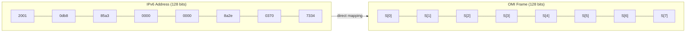
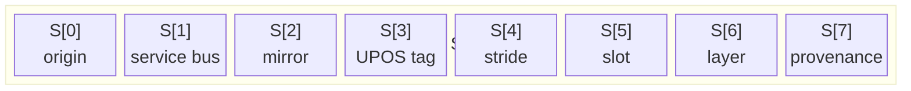

# IPv6 Frame Mapping: 128 Bits → 8 Segments

## The Perfect Overlap

An IPv6 address is 128 bits. An OMI frame is 128 bits. They are the same width — so an OMI frame can be embedded directly in an IPv6 source address.



Each colon-delimited IPv6 group maps to one OMI 16-bit segment:



| Segment | IPv6 Group | OMI Role |
|---------|------------|----------|
| S[0] | Group 1 | Origin/chiral gate |
| S[1] | Group 2 | Service bus port |
| S[2] | Group 3 | Central inversion mirror |
| S[3] | Group 4 | UPOS tag / low data |
| S[4] | Group 5 | Factorial stride |
| S[5] | Group 6 | Sexagesimal slot / free variable |
| S[6] | Group 7 | Factorial layer |
| S[7] | Group 8 | Terminal closure / provenance |

## The /48 Canonical Frame

The canonical OMI address uses a /48 prefix:

```
omi-XXXX-XXXX-XXXX-0000-0000-0000-0000-0000/48
```

This leaves segments 4–7 free for the internal addressing machinery (stride, slot, layer, closure). Rules are expressed as:

```
omi-0000-0000-0000-0000-0078-0000-0000-0000/48 MUST stride-120
```

## CIDR and Partition Topology

CIDR notation (`/n`) defines a cover of the address space. OMI uses prefix lengths to partition the omicron address space into non-overlapping domains:

- `/7` — ULA private fabric base (fc00::/7)
- `/32` — Boot execution entry (7c00 segment)
- `/48` — Canonical frame (8 groups)
- `/80` — Quadratic predicate gate
- `/96` — Barcode carrier format
- `/120` — LAN default frame
- `/128` — Terminal fixed point

## Numerical Interpretation

For a given prefix length `n`, the interval described by `X/n` is:

```
[x · 2^(128-n), x · 2^(128-n) + 2^(128-n) - 1]
```

In OMI terms, this means a rule at `/48` applies to all addresses sharing the first 3 segments — the upper 48 bits of the 128-bit frame.

## Web Protocol and Media Types

The browser-facing transport names are:

| Name | Purpose |
|------|---------|
| `text/x-omi-mnemonic` | Human-readable hyphenated OMI notation |
| `application/x-omi-cbos` | Raw Chiral Binary Object Stream packets |
| `application/x-omi-chronograph` | Full chronograph instruction envelopes |
| `web+omi:` | Browser protocol handler for local OMI routing |

`web+omi:` can be registered with `navigator.registerProtocolHandler()` by an application shell. The handler routes inbound mnemonic URLs to the local compiler, not to a mandatory network transport.

The file naming convention is chiral and hyphenated:

```text
facts.omi    rules.omi    closures.omi    combinators.omi    cons.omi
facts-imo    rules-imo    closures-imo    combinators-imo    cons-imo
omi-CANONICAL_MAPPING_OF_0x0000_TO_0xAA55
```

Open block-scoped NLP payloads are bounded to `0x0000..0x7C00`. Values beyond `0x7C00` are truncated or rejected before Wasm/shared-memory execution.

## Path Derivation

The 128-bit frame is the identity anchor. The three-component model is:

```text
omi---imo = binary rewrite identity
/---/     = routed interpretation path
?---?     = external payload or stream attachment
```

The frame identifies. The path derives. The path is not identity — it is interpretation.

The same identity can derive multiple surfaces through different paths:

```text
omi---imo/128/
omi---imo/semantic/subject/predicate/object/
omi---imo/domain/selector/overlay/
```

The path does not break binary compatibility. Legacy nodes route by identity alone. Path-aware nodes derive clauses from the path segments. The identity remains valid regardless of the path attached to it.

```text
Frame-compatible nodes route.
Path-aware nodes derive.
Receipt-aware nodes accept.
```

## Horn-Clause Interpretation

Path segments act as Horn-clause selectors. A path like `/hardware/i2c/euler/` becomes:

```prolog
domain(Frame, hardware).
interface(Frame, i2c).
selector(Frame, euler).
```

This makes the OMI address not merely a location but a derivation program — a query that describes how data becomes eligible for receipt.

See also: [4.4 Horn-Clause Address Derivation](4.4_HORN_CLAUSE_DERIVATION.md)
